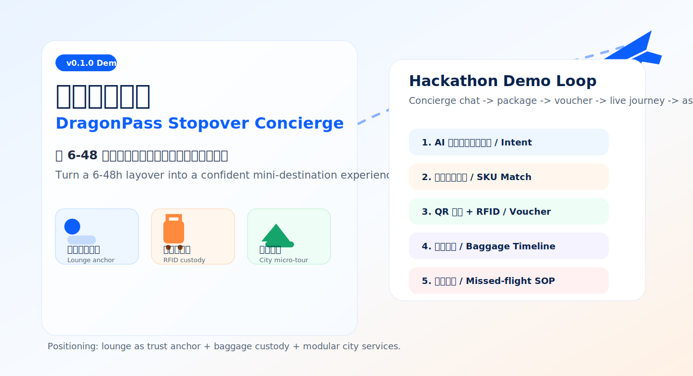
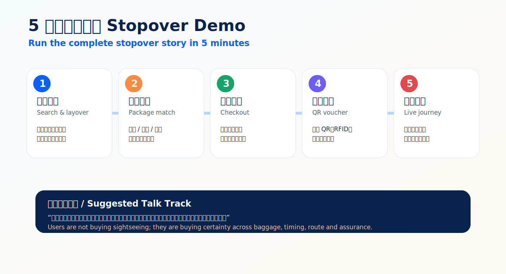
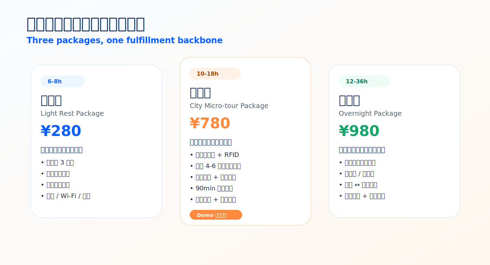
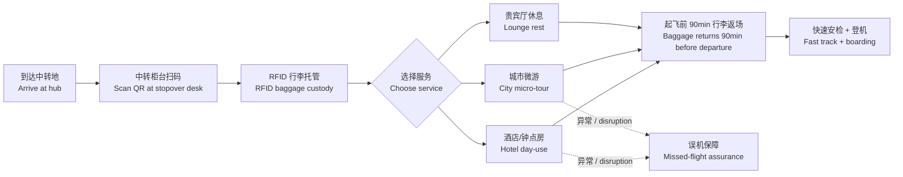
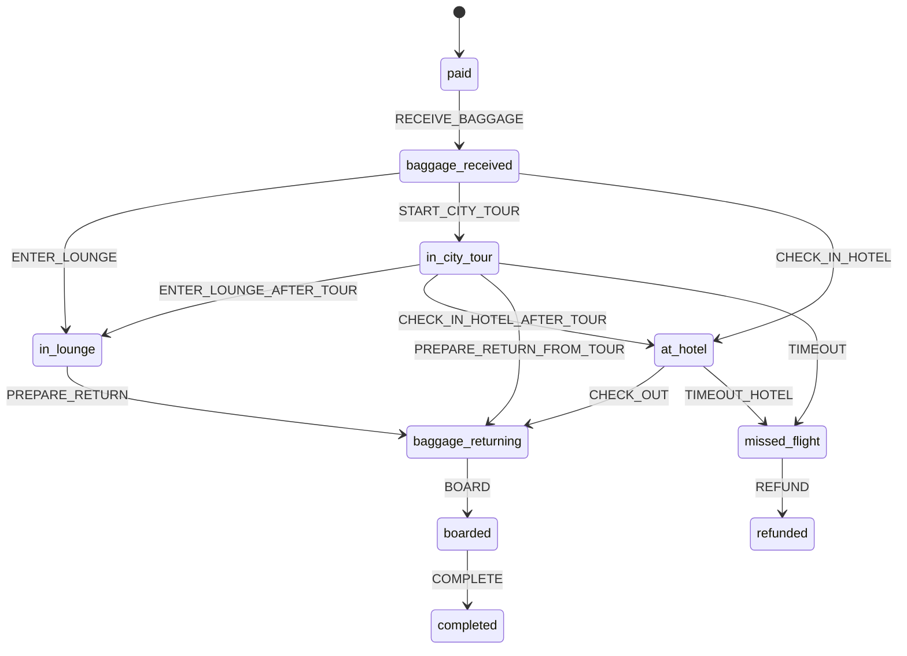
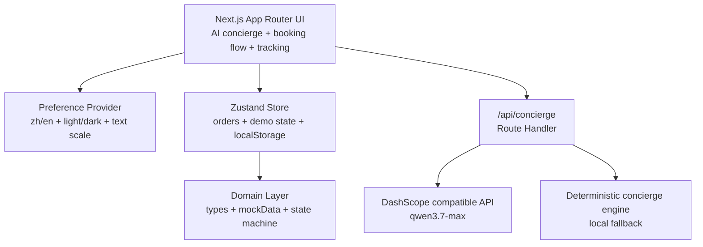

# 龙腾中转礼遇 Stopover Web Demo

**中文**：一个面向 hackathon / 产品评审的中转服务 Web 演示原型，用 AI 礼宾、套餐匹配、RFID 行李托管和误机保障，把 6-48 小时中转等待转化为可购买、可履约、可追踪的轻量目的地体验。

**English**: A hackathon-ready web demo for turning a 6-48h airport layover into a purchasable, trackable mini-destination experience powered by AI concierge, package matching, RFID baggage custody and missed-flight assurance.



## 1. 展示一句话 / Demo One-Liner

> **中文**：用户不是买一次观光，而是在买确定性：行李有人管、时间有人算、出机场有人带、误机有人兜底。
>
> **English**: Users are not buying sightseeing; they are buying certainty across baggage, timing, route guidance and disruption protection.

中文概要：

- 当前版本：**v0.1.0**
- 产品定位：**休息室信任锚 + 行李全托管 + 模块化城市服务**
- 核心场景：**中转 6-48 小时旅客**，尤其是探索型商旅、家庭中转、红眼/长途中转休息人群。

English summary:

- Current version: **v0.1.0**
- Positioning: **lounge as trust anchor + baggage custody + modular city services**
- Target users: **6-48h stopover passengers**, especially exploratory business travelers, families and red-eye recovery travelers.

## 2. Hackathon 演示流 / 5-Minute Demo Flow



| 步骤 | 中文演示重点 | English Talk Track |
| --- | --- | --- |
| 1. AI 礼宾 | 输入“新加坡中转 10 小时，有 1 件行李，想轻松看城市但不能误机” | Ask the concierge for a 10h Singapore layover with one bag and no missed-flight risk. |
| 2. 套餐推荐 | 系统推荐“微游包”，解释中转时长、行李和返场缓冲 | The app recommends the micro-tour package based on layover time, baggage and return buffer. |
| 3. 模拟下单 | 选择增值项，完成履约核验和模拟支付 | Select add-ons, confirm fulfillment details and simulate checkout. |
| 4. 电子凭证 | 展示 QR 凭证、RFID 行李标签和服务触发点 | Show QR voucher, RFID baggage tag and fulfillment triggers. |
| 5. 履约追踪 | 快进状态机，演示行李返场与误机保障 | Fast-forward the state machine to show baggage return and missed-flight assurance. |

演示入口 / Demo entry points:

| 路由 Route | 中文用途 | English Purpose |
| --- | --- | --- |
| `/` | 手机优先 AI 礼宾首页 | Mobile-first AI concierge |
| `/search` | 选择机场、航班和可服务时长 | Airport, flight and service-window selection |
| `/packages` | 三档套餐推荐与增值项 | Package matching and add-ons |
| `/checkout` | 履约核验与模拟支付 | Fulfillment check and simulated payment |
| `/order` | 电子凭证、订单状态、服务触发 | QR voucher, order status and service actions |
| `/journey` | 行李/行程追踪、误机保障 | Baggage/journey tracking and assurance |
| `/pitch` | 展示 PPT 页面 | Pitch deck page |

## 3. 产品包装 / Package Matrix



| 套餐 Package | 适合时长 Duration | 中文价值主张 | English Value |
| --- | --- | --- | --- |
| 轻享包 Light | 6-8h | 贵宾厅 3h + 行李寄存 + 快速安检，适合补眠、洗漱和快速恢复 | Lounge rest, baggage storage and fast-track security for quick recovery. |
| 微游包 Micro-tour | 10-18h | 行李全托管 + 城市 4-6h 微游 + 接送 + 误机保障，当前 demo 推荐主线 | RFID baggage custody, city micro-tour, transfer and missed-flight protection. |
| 过夜包 Overnight | 12-36h | 酒店/钟点房 + 行李直送 + 接送，适合跨夜和家庭中转 | Hotel/day-use room, baggage delivery and transfer for overnight or family layovers. |

增值项 / Add-ons:

- 中文：中转地 eSIM、专车接送、酒店钟点房续住、淋浴、机场餐饮券、AI 停留团餐匹配、私人包车。
- English: eSIM, private transfer, hotel day-use extension, shower, airport meal voucher, AI group-meal matching and private car tour.

## 4. 当前已实现 / What Is Implemented

| 模块 | 中文说明 | English |
| --- | --- | --- |
| AI 礼宾 | `/api/concierge` 调用 DashScope OpenAI-compatible `qwen3.7-max`，无 Key 或失败时降级为本地确定性规则 | Server-side concierge via DashScope-compatible chat completions, with deterministic local fallback. |
| 5 步下单流 | `/search -> /packages -> /checkout -> /order -> /journey` | Complete booking-to-tracking flow. |
| PRD 阈值 | 最低起订 6h；轻享 6-8h、微游 10-18h、过夜 12-36h；4h 为不可订购边界 | PRD-aligned duration thresholds, including a non-bookable 4h boundary case. |
| 订单状态机 | 覆盖支付、收包、休息室、微游、酒店、返场、登机、完成、误机、退款 | Order state machine across normal and disruption paths. |
| RFID 行李追踪 | 按航班到达/起飞时间生成相对时间线 | Baggage timeline derived from flight arrival/departure times. |
| 电子凭证 | 订单页生成 QR 码，展示航班、套餐、行李和履约信息 | QR voucher with flight, package, baggage and fulfillment details. |
| 演示控制台 | 可快速推进状态、触发行李流转和误机保障 | Demo controller for fast-forwarding fulfillment and assurance states. |
| 全局偏好 | 中文/英文、亮色/暗色、文字尺度切换，持久化到 `localStorage` | Language, theme and text-scale preferences persisted in `localStorage`. |
| 构建校验 | 未忽略 TypeScript build errors，`next build` 会执行类型校验 | Production build keeps TypeScript checks enabled. |

## 5. 用户旅行动线 / Passenger Journey



## 6. 状态机 / Fulfillment State Machine



中文说明：状态变化会同步更新行李位置、行李状态、城市游状态和演示日志。关键行李节点按航班相对时间计算，例如到达后约 20 分钟收包，起飞前约 90 分钟返场，起飞前约 60 分钟签收登机。

English: State transitions update baggage location, baggage status, tour status and demo logs. Key baggage timestamps are relative to flight times, such as baggage handoff around arrival +20min, return around departure -90min and boarding around departure -60min.

## 7. 技术架构 / Technical Architecture



| 层级 | 当前实现 |
| --- | --- |
| 应用框架 Framework | Next.js 16.2.9，App Router |
| UI 运行时 UI Runtime | React 19.2.4 |
| 语言 Language | TypeScript 5 |
| 样式 Styling | Tailwind CSS v4，`@tailwindcss/postcss` |
| 状态 State | Zustand 5 + `persist` |
| 时间 Time | Day.js |
| 动效 Motion | Framer Motion |
| 图表 Charts | Recharts |
| QR Code | qrcode.react |
| 图标 Icons | lucide-react |
| AI Concierge | Next.js Route Handler + DashScope OpenAI-compatible API |

## 8. 代码结构 / Code Map

```text
src/
  app/
    layout.tsx              Global layout, app chrome, providers
    page.tsx                AI concierge landing page
    pitch/page.tsx          Hackathon pitch page
    api/concierge/route.ts  Qwen concierge API + deterministic fallback
    (flow)/
      search/page.tsx       Flight and layover selection
      packages/page.tsx     Package matching and add-ons
      checkout/page.tsx     Fulfillment check and simulated payment
      order/page.tsx        QR voucher and order state
      journey/page.tsx      Baggage/tour tracking and assurance demo
  components/features/
    StopoverDashboard.tsx
    MobileConciergeAgent.tsx
    DemoController.tsx
    AppPreferenceProvider.tsx
    PreferenceToolbar.tsx
  lib/
    types.ts
    mockData.ts
    conciergeEngine.ts
    conciergePersonas.ts
    appPreferences.ts
    state-machine/orderState.ts
    store/orderStore.ts
```

## 9. 本地运行 / Local Development

要求 / Requirement: Node.js version compatible with Next.js 16.

```bash
npm install
npm run dev
```

打开 / Open:

```text
http://localhost:3000
```

常用命令 / Useful commands:

```bash
npm run dev      # Development server
npm run build    # Production build + TypeScript checks
npm run start    # Run production build
npm run lint     # ESLint
```

## 10. AI 礼宾配置 / AI Concierge Config

中文：`/api/concierge` 默认使用阿里云 DashScope OpenAI-compatible endpoint。未配置 Key、接口失败或超时时，会返回本地规则引擎结果，保证现场 demo 不会中断。

English: `/api/concierge` defaults to Alibaba Cloud DashScope OpenAI-compatible endpoint. Without a key, or when the model call fails/times out, it falls back to deterministic local rules so the demo remains presentable.

```bash
DASHSCOPE_API_KEY=...
COMPATIBLE_API_KEY=... # Alternative to DASHSCOPE_API_KEY
COMPATIBLE_BASE_URL=https://dashscope.aliyuncs.com/compatible-mode/v1
DEFAULT_MODEL=qwen3.7-max
MODEL_TEMPERATURE=0.2
LLM_CALL_TIMEOUT=10
```

使用 smartbundlex 的百炼配置 / Start with existing smartbundlex DashScope env:

```bash
set -a
source /Users/kaisun/smartbundlex/.env.dev
set +a
npm run dev -- -p 3000
```

## 11. 部署说明 / Deployment Notes

中文：当前版本包含 `/api/concierge` 服务端接口，建议部署到支持 Next serverful 运行时的平台，例如 Vercel、Node Server 或支持 Next Route Handler 的云平台。不建议直接做纯静态导出。

English: This version includes the server-side `/api/concierge` route, so deploy it to a Next serverful runtime such as Vercel, a Node server or a cloud platform supporting Route Handlers. Pure static export is not recommended.

`next.config.ts` 当前设置 / Current settings:

- `images.unoptimized = true`：便于 demo 使用远程图片，不依赖图片优化服务。 / Allows remote demo images without image optimization service.
- `allowedDevOrigins = ['192.168.70.6']`：便于局域网现场访问开发服务器。 / Enables local-network demo access.
- `devIndicators = false`：减少现场演示干扰。 / Keeps the live demo visually clean.

## 12. 非目标和限制 / Non-Goals and Limits

- 中文：不接真实支付、航班动态、行李 IoT/RFID、酒店 PMS、eSIM、餐饮或城市游供应商库存。
- English: No real payment, live flight data, baggage IoT/RFID system, hotel PMS, eSIM, restaurant or city-tour inventory integration.
- 中文：不做用户登录、B2B 分销、签证/入境服务或后台运营系统。
- English: No login, B2B distribution, visa/immigration service or admin console in this demo.
- 中文：这是 C 端体验和履约逻辑 demo，不是生产级订单中台。
- English: This is a consumer experience and fulfillment-logic demo, not a production order platform.
- 中文：i18n 已覆盖主要界面，但部分长运营文案仍可继续结构化。
- English: Core UI i18n exists, while some long-form operational copy can still be moved into structured dictionaries.

## 13. 验收清单 / Demo Acceptance Checklist

- 中文：`/search -> /packages -> /checkout -> /order -> /journey` 可以完整跑通。
- English: The full flow from search to journey tracking works end to end.
- 中文：4h 中转不可订购；6-8h、10-18h、12-36h 分别推荐对应套餐。
- English: 4h is non-bookable; package recommendations align with 6-8h, 10-18h and 12-36h windows.
- 中文：刷新页面后订单不丢失。
- English: The order survives page refresh via local persistence.
- 中文：行李时间线至少展示收件、保管/转运、返场、签收节点。
- English: Baggage timeline shows handoff, custody/transit, return and delivery.
- 中文：演示控制台可以推进正常履约和误机保障分支。
- English: Demo controller can drive both normal fulfillment and missed-flight assurance.
- 中文：中文/英文、亮色/暗色、文字尺度切换可用并持久化。
- English: Language, theme and text-scale preferences work and persist.
- 中文：`npm run build` 通过。
- English: `npm run build` passes.

## 14. 文档来源 / Source Documents

- `docs/stopover-prd-v1.0.md`：产品 PRD、目标用户、验收标准、非目标、风险和上线计划。
- `docs/stopover-prd-v1.0.md`: PRD, target users, acceptance criteria, non-goals, risks and launch plan.
- `docs/stopover-product-map.md`：产品定位、套餐、用户旅行动线、商业模型和里程碑。
- `docs/stopover-product-map.md`: Positioning, package map, passenger journey, business model and milestones.
- `docs/stopover-demo-tech-scaffold.md`：Demo 技术选型、领域模型、状态机、页面流程和演示脚本。
- `docs/stopover-demo-tech-scaffold.md`: Demo technical stack, domain model, state machine, page flow and talk track.
- `docs/frontend-business-review-v0.1.0.md`：v0.1.0 前端与业务 Review，以及当前版本已完成的对齐项。
- `docs/frontend-business-review-v0.1.0.md`: v0.1.0 frontend/business review and completed alignment items.
